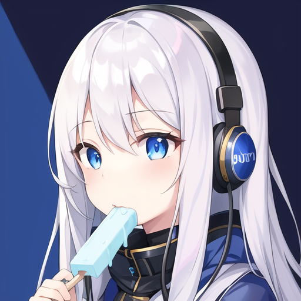
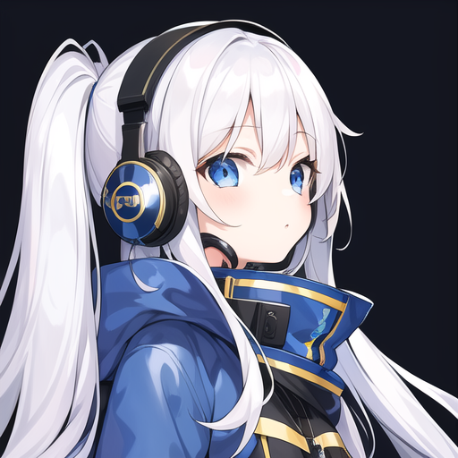

<br>
<br>
<br>
<br>

- 👨‍💻I'm [***RedBoxing***](https://redboxing.fr)
  
- 🖥️ I'm a 17 years old french developer since 2017

- ❤️ Love anime, programming, hacking, video games, and AI

- 🎓 Currently studying in university
  
- 🔭 I’m currently working on **オシリス**

<br/>
<br/>
<br/>
<br/>
<br/>
<br/>



## 🌍 Languages:


## 💻 Software:


## ⚒ Tools 


<br />


<div style="display: flex; justify-content: center;"> 


</div>

<!--START_SECTION:waka-->

```txt
Total Time: 5 hrs 10 mins

C#      4 hrs 44 mins   ███████████████████████░░   91.69 %
XML     19 mins         █▓░░░░░░░░░░░░░░░░░░░░░░░   06.18 %
XAML    3 mins          ▒░░░░░░░░░░░░░░░░░░░░░░░░   01.24 %
Other   2 mins          ▒░░░░░░░░░░░░░░░░░░░░░░░░   00.90 %
```

<!--END_SECTION:waka-->
